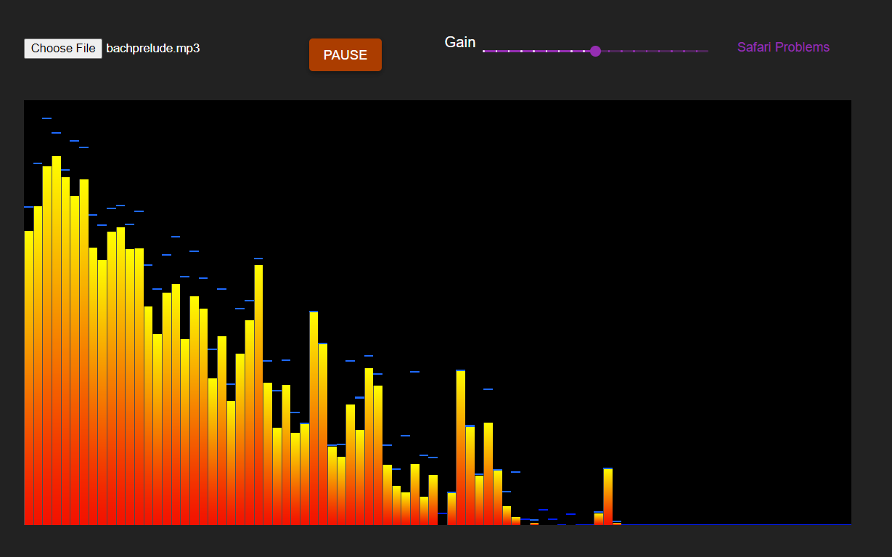

Tjoens
======

[Tjoens](https://otgaard.github.io/Tjoens/)

A demo and experiment in interactive visualisation combining Typescript, WebGL, Web Audio, and React/Material.ui.

Goals:

- Create plug & play module system for visualisers.
- Develop signal analysis functions to improve visualiser response (smoothing, filters, resonators).
- Develop light-weight WebGL library/graphic routines.

Works on all major OSs and browsers, including Android (slowly).

Workaround for [Safari](https://support.shadowhealth.com/hc/en-us/articles/360009548313-Audio-issues-in-Safari).

